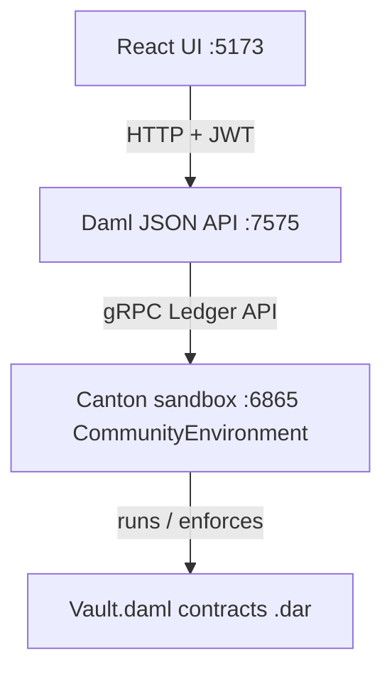

# Legacy Vault

**Private on-chain will & trust management on Canton Network**

Legacy Vault is an institutional-grade vault platform for high-net-worth estate planning. Testators, heirs, and oracles each see a different view of the same vault—Canton-style selective disclosure—while tokenized real-world assets (RWAs) register on a shared ledger and an AI assistant guides setup. When release conditions are met, a trusted oracle confirms the trigger and atomic beneficiary settlement queues on Canton.

HNWI wealth transfer needs privacy, tokenized asset coordination, and trusted release—not public blockchain exposure. See [Forbes: A Digital Tightrope](https://www.forbes.com/councils/forbesbusinesscouncil/2025/02/18/a-digital-tightrope-the-hidden-risks-of-wealth-and-visibility/) for context on the visibility problem.

**Canton Network Hackathon — multi-track submission (Tracks 1, 2, and 3)**

---

## How Legacy Vault uses Canton

Legacy Vault is a **Daml application** running on a **local Canton sandbox**—the same ledger protocol family as Canton Network, executed on your machine for development and demo.



| Layer | What it does |
|-------|----------------|
| **Daml** | Smart-contract language — templates and choices in [`legacy-vault/daml/Vault.daml`](legacy-vault/daml/Vault.daml) |
| **Canton** | Ledger runtime that enforces privacy via signatory/observer sets; `./scripts/dev-ledger.sh` runs `daml start`, which boots the Canton sandbox |
| **JSON API** | HTTP bridge on port `7575`; the React UI queries and exercises choices when ledger mode is enabled |
| **Mock mode** | Default (`VITE_USE_MOCK_LEDGER=true`); fixture data in the UI is unchanged and can be toggled back anytime via `.env.local` |

**Built today:** local Canton sandbox, Daml contracts, five Daml Script tests, UI ledger adapter (`legacy-vault/ui/src/lib/ledger/`), and on-ledger release workflow verified programmatically (Phase 7).

**Not yet:** Canton Network DevNet / public validator deployment, deployed live URL, live RAG agent in the Archival Assistant.

Contract design: [CONTRACT_SPEC.md](docs/legacy-vault/CONTRACT_SPEC.md) · UI wiring: [UI_LEDGER_INTEGRATION.md](docs/legacy-vault/UI_LEDGER_INTEGRATION.md)

---

## What Legacy Vault does

Four parties, one workflow:

| Role | What they do in the product |
|------|----------------------------|
| **Testator (HNWI)** | Create vaults, register tokenized assets, designate heirs |
| **Heir** | See own allocation only; payout status after release |
| **Oracle (Law firm)** | Trigger oversight; confirm release without seeing asset details |
| **Trust Administrator** | Institutional oversight, pending releases queue |

---

## Canton Network Hackathon — three tracks

| Track | Theme | Legacy Vault delivers | See in UI |
|-------|-------|----------------------|-----------|
| **1** | Private DeFi & Capital Markets | Multi-party privacy, role-scoped views | Visibility Architecture, Security Logs |
| **2** | TradeFi, RWA & Tokenized Assets | Token IDs, asset classes, settlement status | Tokenized Holdings, vault asset columns |
| **3** | Payments & Agentic Commerce | Archival Assistant, oracle release, settlement ledger | `/vaults/new`, Confirm release, Settlements tab |

*One institutional workflow spanning all three tracks—privacy, tokenization, and agent-led settlement are all required, not three separate demos.*

### Track → Canton ledger proof

| Track | Theme | On-ledger proof (not just UI) |
|-------|-------|------------------------------|
| **1** | Private DeFi & Capital Markets | Separate `HeirAllocation` / `OracleAssignment` templates; heirs cannot query full `VaultAgreement` (tested in `daml/Scripts/Tests.daml`) |
| **2** | TradeFi, RWA & Tokenized Assets | `TokenizedAsset` template with `tokenId`, `assetClass`, `settlementStatus`; intended-heir observer visibility |
| **3** | Payments & Agentic Commerce | `InitiateVerification` + `ConfirmRelease` choices create `SettlementRecord` + `LedgerEvent` atomically on oracle confirm |

### Judging criteria alignment

Canton Network Hackathon judges score on four dimensions. Legacy Vault maps each to concrete UI and ledger evidence:

| Criterion | How Legacy Vault delivers |
|-----------|---------------------------|
| **Technical execution** | Daml contracts compile; `./scripts/run-daml-tests.sh` (5 tests); UI ledger adapter (`ui/src/lib/ledger/`); `npm run build` passes; visibility matrix + contract spec documented |
| **Originality** | Estate vault with **Canton selective disclosure** — multi-template privacy (not one public contract); oracle-gated release for institutional workflow |
| **UX & design** | Role-scoped dashboards (4 personas); Visibility Architecture; Stitch-aligned institutional UI; mock + ledger mode banner |
| **Real-world applicability** | HNWI / trust-company workflow; Forbes-cited visibility problem; tokenized RWA registry + beneficiary settlement queue |

### Key features (demo-ready UI)

- Role-scoped dashboards (HNWI, Heir, Oracle, Admin shells)
- Tokenized Holdings + Canton registry columns (Token ID, Class, Settlement)
- Visibility Architecture with heir redaction visualization
- Archival Assistant (scripted) with Initiate verification
- Release workflow: oracle confirm → beneficiary payout → Settlements ledger + Security Logs
- Admin pending releases queue

### Demo-ready vs roadmap

| Layer | Status |
|-------|--------|
| React UI + mock release workflow | **Built** |
| Daml contracts (`Vault.daml`) + [CONTRACT_SPEC.md](docs/legacy-vault/CONTRACT_SPEC.md) | **Built** |
| Canton sandbox dev (`./scripts/dev-ledger.sh`) | **Built** |
| UI ↔ JSON API ledger adapter | **Built** — mock default; ledger via `.env.local` |
| On-ledger release workflow (Phase 7) | **Verified** (programmatic); browser walkthrough optional |
| Daml Script tests (visibility + release) | **Built** — `./scripts/run-daml-tests.sh` |
| Daml setup docs + readiness scripts | **Built** — [DAML_SETUP.md](docs/legacy-vault/DAML_SETUP.md) |
| Cursor MCP + local RAG (linkup_mcp 7A) | **Local dev tooling** — see [LINKUP_MCP.md](docs/legacy-vault/LINKUP_MCP.md) |
| Canton Network DevNet deploy | **Roadmap** |
| Live RAG in Archival Assistant (7B) | **Roadmap** |
| Deployed public URL | **Submission task** |

---

## Quick start

**Mock mode (one terminal):**

```bash
./scripts/dev-ui.sh
```

Open http://localhost:5173 — Legacy Vault login screen.

**Full stack — Canton sandbox + ledger mode (two terminals):**

```bash
# Terminal 1 — Canton sandbox + JSON API
./scripts/dev-ledger.sh

# Terminal 2 — UI (ledger mode)
cp legacy-vault/ui/.env.example legacy-vault/ui/.env.local
# Edit .env.local: VITE_USE_MOCK_LEDGER=false
./scripts/dev-ui.sh
```

See [UI_LEDGER_INTEGRATION.md](docs/legacy-vault/UI_LEDGER_INTEGRATION.md) for party mapping and env vars.

### Demo accounts

Password for all accounts: `vault`

| User ID | Role | Home route |
|---------|------|------------|
| `sarah.m` | HNWI (Testator) | `/dashboard` |
| `alex.h` | Heir (Beneficiary) | `/dashboard` |
| `oracle@lawfirm` | Oracle (Law Firm) | `/dashboard` |
| `admin@legacyvault` | Trust Administrator | `/admin` |

**Primary demo vault:** `VLT-001` — *My Will* (Sarah Mitchell · Geneva, CH)

**Suggested demo flow:**

1. `sarah.m` → Tokenized Holdings on dashboard → `/vaults/new` wizard + Archival Assistant
2. `oracle@lawfirm` → `/vaults/VLT-001` → **Confirm release trigger**
3. `alex.h` → Beneficiary payout card → Ledger **Settlements** tab

Sign out between recording takes to reset release workflow state in **mock mode**. In **ledger mode**, release state persists on Canton (not `sessionStorage`).

---

## Hackathon submission

| Deliverable | Status |
|-------------|--------|
| Public repository | [github.com/kylabuildsthings-oss/legacy-vault](https://github.com/kylabuildsthings-oss/legacy-vault) |
| Presentation deck | Add link when ready |
| 3-minute demo video | Add link when ready |
| Live product URL | Add link when deployed |

---

## For developers

### Workspace layout

```text
LEGACYVAULT/
├── legacy-vault/
│   ├── daml/              # Daml contracts + Scripts (Setup, Tests)
│   ├── daml.yaml
│   └── ui/                # React + Vite frontend
│       └── src/lib/ledger/  # JSON API adapter (mock vs ledger toggle)
├── linkup_mcp/            # Cursor MCP + RAG (gitignored locally)
├── decentralized-will-management/  # UI reference only
├── docs/legacy-vault/     # Project docs
└── scripts/               # dev-ui.sh, dev-ledger.sh, setup-daml.sh, …
```

### Project status

| Area | Status |
|------|--------|
| UI (Steps 1, 3–6) + hackathon tracks UI | Done |
| Daml backend onboarding | Done — [DAML_SETUP.md](docs/legacy-vault/DAML_SETUP.md) · `./scripts/setup-daml.sh` |
| Daml contracts + Script tests | Done — [CONTRACT_SPEC.md](docs/legacy-vault/CONTRACT_SPEC.md) · `./scripts/run-daml-tests.sh` |
| UI ledger integration | Done — [UI_LEDGER_INTEGRATION.md](docs/legacy-vault/UI_LEDGER_INTEGRATION.md) |
| On-ledger workflow verification (Phase 7) | Done (programmatic) |
| linkup_mcp RAG (Step 7A) | Local setup — [LINKUP_MCP.md](docs/legacy-vault/LINKUP_MCP.md) · `./scripts/sync-rag-corpus.sh` |
| In-app live RAG (Step 7B) | Roadmap |
| Canton Network DevNet deploy | Roadmap |

Step completion details: [STEP1_COMPLETE.md](docs/legacy-vault/STEP1_COMPLETE.md) · [STEP4_COMPLETE.md](docs/legacy-vault/STEP4_COMPLETE.md) · [STEP5_COMPLETE.md](docs/legacy-vault/STEP5_COMPLETE.md) · [STEP6_ADMIN_COMPLETE.md](docs/legacy-vault/STEP6_ADMIN_COMPLETE.md)

Role visibility matrix: [ROLE_VISIBILITY_MATRIX.md](docs/legacy-vault/ROLE_VISIBILITY_MATRIX.md)

### Scripts

| Script | Purpose |
|--------|---------|
| `./scripts/dev-ui.sh` | Start React UI at http://localhost:5173 |
| `./scripts/dev-ledger.sh` | Build + `daml start` (Canton sandbox + JSON API :7575) |
| `./scripts/setup-daml.sh` | Check Java + Daml SDK readiness |
| `./scripts/run-daml-tests.sh` | Run 5 Daml Script visibility/workflow tests |
| `./scripts/install-java.sh` | Install JDK 17 for Daml |
| `./scripts/install-daml.sh` | Install Daml SDK |
| `./scripts/sync-rag-corpus.sh` | Copy vault docs into local `linkup_mcp/data/` for RAG |

### Cursor MCP + RAG (optional, local only)

The UI demo uses a **scripted** Archival Assistant. For document Q&A while building, set up **linkup_mcp** locally (gitignored — not in this repo):

1. Clone or restore `linkup_mcp/` beside this project
2. `ollama pull llama3.2` · `cd linkup_mcp && uv sync --python 3.12`
3. `./scripts/sync-rag-corpus.sh`
4. Configure `~/.cursor/mcp.json` — see [PREREQUISITES.md](docs/legacy-vault/PREREQUISITES.md)

Full guide: [LINKUP_MCP.md](docs/legacy-vault/LINKUP_MCP.md)

### Prerequisites

| Tool | Required for | Notes |
|------|--------------|-------|
| Node.js 18+ | UI | Required |
| npm | UI deps | Required |
| Java 17 | Daml / Canton sandbox | Ledger mode — see [DAML_SETUP.md](docs/legacy-vault/DAML_SETUP.md) · `./scripts/install-java.sh` |
| Daml SDK 2.2+ | Contracts + sandbox | Ledger mode — see [DAML_SETUP.md](docs/legacy-vault/DAML_SETUP.md) · `./scripts/install-daml.sh` |
| uv + Ollama + `llama3.2` | Step 7A MCP RAG (local) | Optional — see [LINKUP_MCP.md](docs/legacy-vault/LINKUP_MCP.md) |

Details: [docs/legacy-vault/PREREQUISITES.md](docs/legacy-vault/PREREQUISITES.md)

**Daml backend:** [DAML_SETUP.md](docs/legacy-vault/DAML_SETUP.md) · run `./scripts/setup-daml.sh`

### Full stack (ledger mode)

```bash
# Terminal 1
./scripts/dev-ledger.sh

# Terminal 2
cp legacy-vault/ui/.env.example legacy-vault/ui/.env.local
# Set VITE_USE_MOCK_LEDGER=false in .env.local
./scripts/dev-ui.sh
```

Full guide: [UI_LEDGER_INTEGRATION.md](docs/legacy-vault/UI_LEDGER_INTEGRATION.md)
