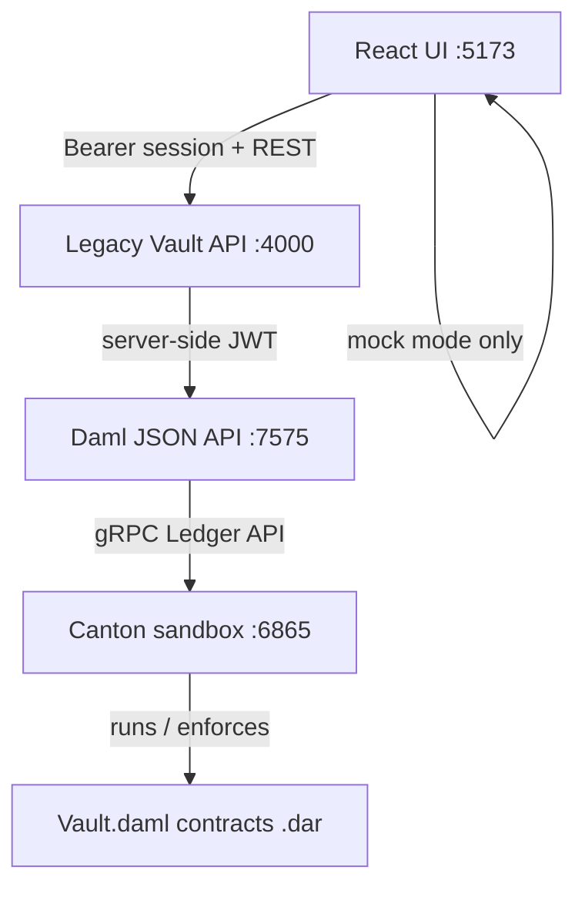

# Legacy Vault

**Private on-chain will & trust management on Canton Network**

Legacy Vault is an institutional-grade vault platform for high-net-worth estate planning. Testators, heirs, and oracles each see a different view of the same vault—Canton-style selective disclosure—while tokenized real-world assets (RWAs) register on a shared ledger and an AI assistant guides setup. When release conditions are met, a trusted oracle confirms the trigger and atomic beneficiary settlement queues on Canton.

HNWI wealth transfer needs privacy, tokenized asset coordination, and trusted release—not public blockchain exposure. See [Forbes: A Digital Tightrope](https://www.forbes.com/councils/forbesbusinesscouncil/2025/02/18/a-digital-tightrope-the-hidden-risks-of-wealth-and-visibility/) for context on the visibility problem.

**Canton Network Hackathon — multi-track submission (Tracks 1, 2, and 3)**

---

## How Legacy Vault uses Canton

Legacy Vault is a **Daml application** running on a **local Canton sandbox**—the same ledger protocol family as Canton Network, executed on your machine for development and demo.



| Layer | What it does |
|-------|----------------|
| **Daml** | Smart-contract language — templates and choices in [`legacy-vault/daml/Vault.daml`](legacy-vault/daml/Vault.daml) |
| **Canton** | Ledger runtime that enforces privacy via signatory/observer sets; `./scripts/dev-ledger.sh` runs `daml start` |
| **JSON API** | HTTP bridge on port `7575`; the **backend API** queries and exercises choices in ledger mode |
| **Backend API** | Fastify server on port `4000` — auth, vaults, assistant, release commands; UI calls this instead of Canton directly |
| **Mock mode** | Default (`VITE_USE_MOCK_LEDGER=true`); fixture data in the UI; toggle via `.env.local` |

**Built today:** full product backend (Phases 1–7), UI wired to API in ledger mode, backend Archival Assistant with role-scoped Canton context, vault creation on Canton, Postgres foundation, Phase 8 hardening tests, and LLM/RAG provider scaffold.

**Not yet:** Canton Network DevNet / public validator deployment, deployed live URL, live LLM/RAG model wiring (scaffold + plan only).

Contract design: [CONTRACT_SPEC.md](docs/legacy-vault/CONTRACT_SPEC.md) · UI wiring: [UI_LEDGER_INTEGRATION.md](docs/legacy-vault/UI_LEDGER_INTEGRATION.md)

---

## What Legacy Vault does

Four parties, one workflow:

| Role | What they do in the product |
|------|----------------------------|
| **Testator (HNWI)** | Create vaults, register tokenized assets, designate heirs |
| **Heir** | See own allocation only; payout status after release |
| **Oracle (Law firm)** | Trigger oversight; confirm release without seeing asset details |
| **Trust Administrator** | Institutional oversight, pending releases queue |

---

## Canton Network Hackathon — three tracks

| Track | Theme | Legacy Vault delivers | See in UI |
|-------|-------|----------------------|-----------|
| **1** | Private DeFi & Capital Markets | Multi-party privacy, role-scoped views | Visibility Architecture, Security Logs |
| **2** | TradeFi, RWA & Tokenized Assets | Token IDs, asset classes, settlement status | Tokenized Holdings, vault asset columns |
| **3** | Payments & Agentic Commerce | Archival Assistant, oracle release, settlement ledger | `/vaults/new`, Confirm release, Settlements tab |

*One institutional workflow spanning all three tracks—privacy, tokenization, and agent-led settlement are all required, not three separate demos.*

### Track → Canton ledger proof

| Track | Theme | On-ledger proof (not just UI) |
|-------|-------|------------------------------|
| **1** | Private DeFi & Capital Markets | Separate `HeirAllocation` / `OracleAssignment` templates; heirs cannot query full `VaultAgreement` (tested in `daml/Scripts/Tests.daml`) |
| **2** | TradeFi, RWA & Tokenized Assets | `TokenizedAsset` template with `tokenId`, `assetClass`, `settlementStatus`; intended-heir observer visibility |
| **3** | Payments & Agentic Commerce | `InitiateVerification` + `ConfirmRelease` choices create `SettlementRecord` + `LedgerEvent` atomically on oracle confirm |

### Judging criteria alignment

Canton Network Hackathon judges score on four dimensions. Legacy Vault maps each to concrete UI and ledger evidence:

| Criterion | How Legacy Vault delivers |
|-----------|---------------------------|
| **Technical execution** | Daml contracts compile; `./scripts/run-daml-tests.sh` (5 tests); UI ledger adapter (`ui/src/lib/ledger/`); `npm run build` passes; visibility matrix + contract spec documented |
| **Originality** | Estate vault with **Canton selective disclosure** — multi-template privacy (not one public contract); oracle-gated release for institutional workflow |
| **UX & design** | Role-scoped dashboards (4 personas); Visibility Architecture; Stitch-aligned institutional UI; mock + ledger mode banner |
| **Real-world applicability** | HNWI / trust-company workflow; Forbes-cited visibility problem; tokenized RWA registry + beneficiary settlement queue |

### Key features (demo-ready UI)

- Role-scoped dashboards (HNWI, Heir, Oracle, Admin shells)
- Tokenized Holdings + Canton registry columns (Token ID, Class, Settlement)
- Visibility Architecture with heir redaction visualization
- Archival Assistant (backend + Canton context) with Initiate verification
- Release workflow: oracle confirm → beneficiary payout → Settlements ledger + Security Logs
- Admin pending releases queue

### Demo-ready vs roadmap

| Layer | Status |
|-------|--------|
| React UI + mock release workflow | **Built** |
| Daml contracts (`Vault.daml`) + [CONTRACT_SPEC.md](docs/legacy-vault/CONTRACT_SPEC.md) | **Built** |
| Canton sandbox dev (`./scripts/dev-ledger.sh`) | **Built** |
| Backend API (`legacy-vault/api`) | **Built** — auth, vaults, assistant, release, rename |
| UI → backend API (ledger mode) | **Built** — UI no longer calls Canton directly |
| Ledger-backed vault creation (`POST /vaults`) | **Built** |
| Backend Archival Assistant | **Built** — [ASSISTANT.md](docs/legacy-vault/ASSISTANT.md) |
| Postgres product persistence (optional) | **Built** — `./scripts/db-migrate.sh` |
| API hardening + tests (Phase 8B) | **Built** — [PHASE8_HARDENING.md](docs/legacy-vault/PHASE8_HARDENING.md) |
| LLM/RAG provider scaffold | **Planned** — [ASSISTANT_RAG_PLAN.md](docs/legacy-vault/ASSISTANT_RAG_PLAN.md) |
| Daml Script tests (visibility + release) | **Built** — `./scripts/run-daml-tests.sh` |
| Cursor MCP (linkup_mcp) | **Optional dev tooling** — [LINKUP_MCP.md](docs/legacy-vault/LINKUP_MCP.md) |
| Canton Network DevNet deploy | **Roadmap** |
| Deployed public URL | **Submission task** |

---

## Quick start

**Mock mode (one terminal):**

```bash
./scripts/dev-ui.sh
```

Open http://localhost:5173 — Legacy Vault login screen.

**Full stack — Canton + backend API + UI (three terminals, ledger mode):**

```bash
# Terminal 1 — Canton sandbox + JSON API
./scripts/dev-ledger.sh

# Terminal 2 — Backend API
./scripts/dev-api.sh

# Terminal 3 — UI (ledger mode)
cp legacy-vault/ui/.env.example legacy-vault/ui/.env.local
# Edit .env.local: VITE_USE_MOCK_LEDGER=false
./scripts/dev-ui.sh
```

Sign in as a demo user after starting the API — the UI stores a backend session token. If you logged in before auth was added, sign out and sign back in.

See [UI_LEDGER_INTEGRATION.md](docs/legacy-vault/UI_LEDGER_INTEGRATION.md) for party mapping and env vars.

API health check: http://localhost:4000/health

### Demo accounts

Password for all accounts: `vault`

| User ID | Role | Home route |
|---------|------|------------|
| `sarah.m` | HNWI (Testator) | `/dashboard` |
| `alex.h` | Heir (Beneficiary) | `/dashboard` |
| `oracle@lawfirm` | Oracle (Law Firm) | `/dashboard` |
| `admin@legacyvault` | Trust Administrator | `/admin` |

**Primary demo vault:** `VLT-001` — *My Will* (Sarah Mitchell · Geneva, CH)

**Suggested demo flow:**

1. `sarah.m` → Tokenized Holdings on dashboard → `/vaults/new` wizard + Archival Assistant
2. `oracle@lawfirm` → `/vaults/VLT-001` → **Confirm release trigger**
3. `alex.h` → Beneficiary payout card → Ledger **Settlements** tab

Sign out between recording takes to reset release workflow state in **mock mode**. In **ledger mode**, release state persists on Canton (not `sessionStorage`).

---

## Hackathon submission

| Deliverable | Status |
|-------------|--------|
| Public repository | [github.com/kylabuildsthings-oss/legacy-vault](https://github.com/kylabuildsthings-oss/legacy-vault) |
| Presentation deck | Add link when ready |
| 3-minute demo video | Add link when ready |
| Live product URL | Add link when deployed |

---

## For developers

### Workspace layout

```text
LEGACYVAULT/
├── legacy-vault/
│   ├── daml/              # Daml contracts + Scripts (Setup, Tests)
│   ├── daml.yaml
│   ├── api/               # Fastify backend — auth, vaults, assistant, ledger proxy
│   └── ui/                # React + Vite frontend
│       └── src/lib/api/   # Backend API client (ledger mode)
│       └── src/lib/ledger/  # Mock ledger + legacy adapter
├── linkup_mcp/            # Cursor MCP + RAG (gitignored locally)
├── decentralized-will-management/  # UI reference only
├── docs/legacy-vault/     # Project docs
└── scripts/               # dev-ui.sh, dev-ledger.sh, setup-daml.sh, …
```

### Project status

| Area | Status |
|------|--------|
| UI (Steps 1, 3–6) + hackathon tracks UI | Done |
| Daml backend onboarding | Done — [DAML_SETUP.md](docs/legacy-vault/DAML_SETUP.md) · `./scripts/setup-daml.sh` |
| Daml contracts + Script tests | Done — [CONTRACT_SPEC.md](docs/legacy-vault/CONTRACT_SPEC.md) · `./scripts/run-daml-tests.sh` |
| UI ledger integration (mock mode) | Done — [UI_LEDGER_INTEGRATION.md](docs/legacy-vault/UI_LEDGER_INTEGRATION.md) |
| Backend API (Phases 1–7) | Done — [legacy-vault/api](legacy-vault/api) · `./scripts/dev-api.sh` |
| Server-side ledger (JWT, parties, JSON API client) | Done |
| Backend auth + protected routes | Done — `/auth/login`, `/me`, role-gated `/vaults` |
| Postgres product persistence (optional) | Done — `./scripts/db-migrate.sh` |
| Ledger-backed vault creation | Done — `POST /vaults` creates Daml contracts on Canton |
| Vault rename | Done — `PATCH /vaults/:vaultId` (HNWI only) |
| Backend Archival Assistant | Done — [ASSISTANT.md](docs/legacy-vault/ASSISTANT.md) |
| API hardening + tests (Phase 8B) | Done — [PHASE8_HARDENING.md](docs/legacy-vault/PHASE8_HARDENING.md) |
| LLM/RAG provider scaffold | Planned — [ASSISTANT_RAG_PLAN.md](docs/legacy-vault/ASSISTANT_RAG_PLAN.md) |
| linkup_mcp (optional Cursor MCP) | Local setup — [LINKUP_MCP.md](docs/legacy-vault/LINKUP_MCP.md) |
| Canton Network DevNet deploy | Roadmap |

### Recent product changes (Phases 1–8)

**Backend API (`legacy-vault/api/`)**

- Fastify server with CORS, structured config, and `/health`
- Session auth (`POST /auth/login`, `GET /me`) with TTL expiry on tokens
- Server-side Canton integration: Daml JWT signing, party resolution, JSON API client (10s timeout)
- Protected vault routes: list, snapshot, release commands, create (`POST /vaults`), rename (`PATCH /vaults/:vaultId`)
- Optional Postgres: migrations for users, orgs, drafts, documents, audit events, assistant conversations (`./scripts/db-migrate.sh`)
- **42 passing API tests** — session, routes, assistant intent routing, role-aware policies

**UI → backend wiring**

- React UI calls the backend API in ledger mode (no direct Canton from the browser)
- `AuthContext` stores backend session token; login flows through `/auth/login`
- Vault wizard submits to `POST /vaults`; Archival Assistant calls `POST /assistant/query`
- Assistant panel shows **Backend Active** (deterministic engine, not a third-party agent)

**Archival Assistant**

- Deterministic rule engine over role-scoped Canton vault snapshots
- Intent routing: guidance questions (`how`, `what if`, `change`, `designate`, …) vs status summaries
- Role-aware answers for HNWI, heir, oracle, and admin personas
- Provider scaffold: `deterministic` (default), `localRag`, `hostedLlm` — see [ASSISTANT_RAG_PLAN.md](docs/legacy-vault/ASSISTANT_RAG_PLAN.md)
- Safety policies: block chat mutations, redact ledger fields for LLM context, validate responses
- Docs: [ASSISTANT.md](docs/legacy-vault/ASSISTANT.md)

**Daml / ledger**

- `RenameVault`, `RenameOracleAssignmentDisplay`, `RenameHeirAllocationDisplay` choices in `Vault.daml`
- Migration fallback for older package contracts: archive + recreate when native rename unavailable
- Snapshot filtering: oracle/heir rows matched to active agreement name; skip archived agreements

**Phase 8 hardening**

- Generic 500 error responses with internal logging
- Configurable `SESSION_TTL_SECONDS`
- Test suite: `cd legacy-vault/api && npm test`
- Details: [PHASE8_HARDENING.md](docs/legacy-vault/PHASE8_HARDENING.md)

**New scripts**

| Script | Purpose |
|--------|---------|
| `./scripts/dev-api.sh` | Start backend API at http://localhost:4000 |
| `./scripts/db-migrate.sh` | Apply Postgres migrations + demo seed data |

**Key API environment variables** (see `legacy-vault/api/.env.example`)

| Variable | Purpose |
|----------|---------|
| `DATABASE_URL` | Optional Postgres connection |
| `SESSION_SECRET` | Session token signing |
| `SESSION_TTL_SECONDS` | Token expiry (default 24h) |
| `DAML_JSON_API_URL` | Canton JSON API (default `http://127.0.0.1:7575`) |
| `DAML_PACKAGE_ID` | Deployed Daml package ID |
| `ASSISTANT_PROVIDER` | `deterministic` \| `localRag` \| `hostedLlm` |

Step completion details: [STEP1_COMPLETE.md](docs/legacy-vault/STEP1_COMPLETE.md) · [STEP4_COMPLETE.md](docs/legacy-vault/STEP4_COMPLETE.md) · [STEP5_COMPLETE.md](docs/legacy-vault/STEP5_COMPLETE.md) · [STEP6_ADMIN_COMPLETE.md](docs/legacy-vault/STEP6_ADMIN_COMPLETE.md)

Role visibility matrix: [ROLE_VISIBILITY_MATRIX.md](docs/legacy-vault/ROLE_VISIBILITY_MATRIX.md)

### Scripts

| Script | Purpose |
|--------|---------|
| `./scripts/dev-ui.sh` | Start React UI at http://localhost:5173 |
| `./scripts/dev-api.sh` | Start backend API at http://localhost:4000 |
| `./scripts/db-migrate.sh` | Apply API Postgres migrations and demo seed data |
| `./scripts/dev-ledger.sh` | Build + `daml start` (Canton sandbox + JSON API :7575) |
| `./scripts/setup-daml.sh` | Check Java + Daml SDK readiness |
| `./scripts/run-daml-tests.sh` | Run 5 Daml Script visibility/workflow tests |
| `./scripts/install-java.sh` | Install JDK 17 for Daml |
| `./scripts/install-daml.sh` | Install Daml SDK |
| `./scripts/sync-rag-corpus.sh` | Copy vault docs into local `linkup_mcp/data/` for RAG |

### Archival Assistant

The in-app **Archival Assistant** is backend-powered: `POST /assistant/query` with role-scoped Canton vault context. Default provider is **deterministic** (rule engine + intent routing). LLM/RAG is scaffolded but not wired to a live model yet. See [ASSISTANT.md](docs/legacy-vault/ASSISTANT.md) and [ASSISTANT_RAG_PLAN.md](docs/legacy-vault/ASSISTANT_RAG_PLAN.md).

For document Q&A while building in Cursor, you can optionally set up **linkup_mcp** locally (gitignored — not required for the product UI):

1. Clone or restore `linkup_mcp/` beside this project
2. `ollama pull llama3.2` · `cd linkup_mcp && uv sync --python 3.12`
3. `./scripts/sync-rag-corpus.sh`
4. Configure `~/.cursor/mcp.json` — see [PREREQUISITES.md](docs/legacy-vault/PREREQUISITES.md)

Full guide: [LINKUP_MCP.md](docs/legacy-vault/LINKUP_MCP.md)

### Prerequisites

| Tool | Required for | Notes |
|------|--------------|-------|
| Node.js 18+ | UI | Required |
| npm | UI deps | Required |
| Java 17 | Daml / Canton sandbox | Ledger mode — see [DAML_SETUP.md](docs/legacy-vault/DAML_SETUP.md) · `./scripts/install-java.sh` |
| Daml SDK 2.2+ | Contracts + sandbox | Ledger mode — see [DAML_SETUP.md](docs/legacy-vault/DAML_SETUP.md) · `./scripts/install-daml.sh` |
| uv + Ollama + `llama3.2` | Optional Cursor MCP (linkup_mcp) | Not required for the product UI — see [LINKUP_MCP.md](docs/legacy-vault/LINKUP_MCP.md) |

Details: [docs/legacy-vault/PREREQUISITES.md](docs/legacy-vault/PREREQUISITES.md)

**Daml backend:** [DAML_SETUP.md](docs/legacy-vault/DAML_SETUP.md) · run `./scripts/setup-daml.sh`

### API tests

```bash
cd legacy-vault/api
npm test
npm run typecheck
```

### Full stack (ledger mode)

```bash
# Terminal 1 — Canton
./scripts/dev-ledger.sh

# Terminal 2 — Backend API
./scripts/dev-api.sh

# Terminal 3 — UI
cp legacy-vault/ui/.env.example legacy-vault/ui/.env.local
# Set VITE_USE_MOCK_LEDGER=false in .env.local
./scripts/dev-ui.sh
```

Full guide: [UI_LEDGER_INTEGRATION.md](docs/legacy-vault/UI_LEDGER_INTEGRATION.md)

### Backend API reference

```bash
curl http://localhost:4000/ledger/parties
curl http://localhost:4000/ledger/sessions/sarah.m/party
```

Authenticated backend flow:

```bash
curl -X POST http://localhost:4000/auth/login \
  -H 'Content-Type: application/json' \
  -d '{"userId":"sarah.m","password":"vault"}'
```
