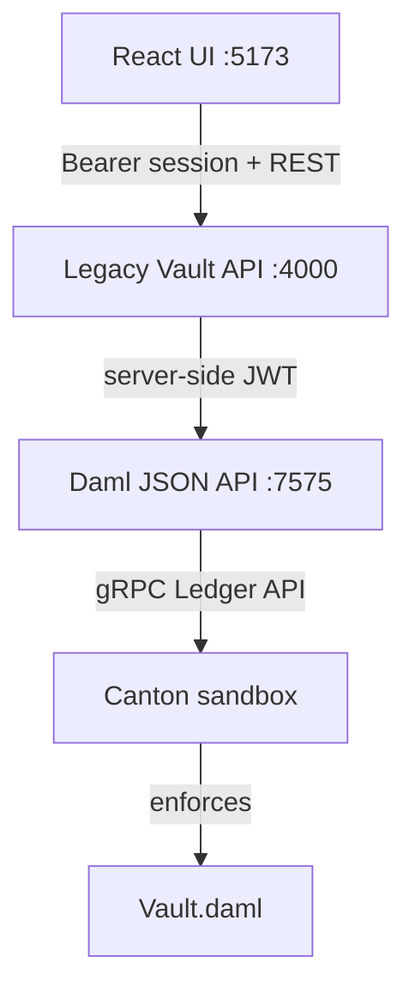
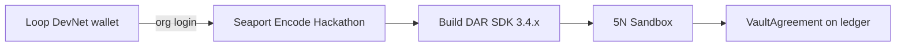

# Legacy Vault

**Private on-chain will & trust management on Canton Network**

Legacy Vault is an institutional-grade vault platform for high-net-worth estate planning. Testators, heirs, and oracles each see a different view of the same vault—Canton-style selective disclosure—while tokenized real-world assets (RWAs) register on a shared ledger and an AI assistant guides setup. When release conditions are met, a trusted oracle confirms the trigger and atomic beneficiary settlement queues on Canton.

HNWI wealth transfer needs privacy, tokenized asset coordination, and trusted release—not public blockchain exposure. See [Forbes: A Digital Tightrope](https://www.forbes.com/councils/forbesbusinesscouncil/2025/02/18/a-digital-tightrope-the-hidden-risks-of-wealth-and-visibility/) for context on the visibility problem.

**Canton Network Hackathon — multi-track submission (Tracks 1, 2, and 3)**

---

## For judges

| Try this | Link |
|----------|------|
| **Public demo** (no install) | [legacy-vault-eta.vercel.app/login](https://legacy-vault-eta.vercel.app/login) — sign in `sarah.m` / `vault` |
| **Live Canton stack** (technical review) | Clone repo → [Quick start](#quick-start) — 3 terminals, Java 17 + Daml SDK |
| **Canton DevNet proof** | Encode [Seaport](https://app.devnet.seaport.to) → **5N Sandbox** — DAR `legacy-vault-0.0.1.dar` + live `VaultAgreement` — see [Canton DevNet](#canton-devnet-encode-seaport) |
| **Demo video** | *(add 3-min video URL when recorded)* |

**How to read the surfaces:** Vercel is **Public Demo** (sample data). The local stack is **Live Canton Backend** for the full product workflow. **DevNet** on-ledger proof is Seaport create/exercise on **5N Sandbox** — the hosted UI is **not** wired to DevNet (same `Vault.daml` model, separate runtimes).

---

## How Legacy Vault uses Canton

Legacy Vault is a **Daml application** on the Canton protocol family with **three surfaces** that share the same contract model ([`Vault.daml`](legacy-vault/daml/Vault.daml)):

1. **Local Canton sandbox** — full UI → API → ledger for development and the demo video  
2. **Public demo (Vercel)** — product UX without requiring judges to install the stack  
3. **Canton DevNet (Encode Seaport)** — DAR deployed and contracts created on the shared **5N Sandbox** validator  

### Product / local live stack



| Layer | What it does |
|-------|----------------|
| **Daml** | Smart-contract language — templates and choices in [`legacy-vault/daml/Vault.daml`](legacy-vault/daml/Vault.daml) |
| **Canton** | Ledger runtime that enforces privacy via signatory/observer sets; `./scripts/dev-ledger.sh` runs `daml start` |
| **JSON API** | HTTP bridge on port `7575`; the **backend API** queries and exercises choices in live mode |
| **Backend API** | Fastify server on port `4000` — auth, vaults, assistant, release commands; UI calls this instead of Canton directly |
| **Demo Data Mode** | Developer fallback — UI fixture data when Canton/backend are not running; labelled clearly in the app |

**Developer fallback:** set `VITE_USE_MOCK_LEDGER=true` in `legacy-vault/ui/.env.local` to run UI-only with mock fixtures (no Canton/backend required).

### Canton DevNet proof (Encode Seaport)



| Piece | Detail |
|-------|--------|
| **Workspace** | Encode Hackathon org on [app.devnet.seaport.to](https://app.devnet.seaport.to) |
| **Validator** | **5N Sandbox** (development) |
| **DAR** | `legacy-vault-0.0.1.dar` (built in Seaport; local repo SDK 2.2 DAR is for sandbox only) |
| **On-ledger** | `VaultAgreement` created (e.g. `VLT-DEVNET-001`) |
| **actAs** | Use the Seaport **5N Sandbox actAs** party for create/exercise — not the Loop login Party ID alone |

Vercel and the local UI do **not** submit transactions to 5N Sandbox. DevNet compliance is the Seaport deploy + create (and optional exercise) path.

### Canton DevNet (Encode Seaport)

Encode requires projects **deployed live on Canton DevNet** (LocalNet/sandbox alone does not qualify). Legacy Vault meets that via Seaport:

1. Join **Encode Hackathon** in Seaport (Loop DevNet Party ID invited by organizers)  
2. **New Blank Project** → paste [`Vault.daml`](legacy-vault/daml/Vault.daml) → keep Seaport `daml.yaml` SDK (**3.4.11**) → **Build Project**  
3. **Deploy** `legacy-vault-0.0.1.dar` → **5N Sandbox**  
4. **Create Contract** → template `VaultAgreement` using the sandbox **actAs** party for testator / oracle / admin  

Local `daml.yaml` remains **SDK 2.2** for the sandbox quick start. Seaport rebuilds the DAR for DevNet’s newer LF format (an SDK 2.2 `.dar` upload fails Inspect with “no valid dalf”).

**Product status:** Complete hackathon product on the local Canton sandbox — React UI, backend API, Daml contracts, role-scoped workflows, Archival Assistant, vault create/rename on Canton, **42** API tests + **5** Daml Script tests — plus **Canton DevNet** DAR deploy and live contract on **5N Sandbox**.

**Submission remaining** (deliverables): 3-minute demo video, presentation deck. **Public demo:** [legacy-vault-eta.vercel.app/login](https://legacy-vault-eta.vercel.app/login). See [Hackathon submission](#hackathon-submission).

**Optional later:** Wire the hosted UI/API to DevNet Ledger API; live LLM/RAG assistant ([ASSISTANT_RAG_PLAN.md](docs/legacy-vault/ASSISTANT_RAG_PLAN.md)).

Contract design: [CONTRACT_SPEC.md](docs/legacy-vault/CONTRACT_SPEC.md) · UI wiring: [UI_LEDGER_INTEGRATION.md](docs/legacy-vault/UI_LEDGER_INTEGRATION.md)

---

## What Legacy Vault does

Four parties, one workflow:

| Role | What they do in the product |
|------|----------------------------|
| **Testator (HNWI)** | Create vaults, register tokenized assets, designate heirs |
| **Heir** | See own allocation only; payout status after release |
| **Oracle (Law firm)** | Trigger oversight; confirm release without seeing asset details |
| **Trust Administrator** | Institutional oversight, pending releases queue |

---

## Canton Network Hackathon — three tracks

| Track | Theme | Legacy Vault delivers | See in UI |
|-------|-------|----------------------|-----------|
| **1** | Private DeFi & Capital Markets | Multi-party privacy, role-scoped views | Visibility Architecture, Security Logs |
| **2** | TradeFi, RWA & Tokenized Assets | Token IDs, asset classes, settlement status | Tokenized Holdings, vault asset columns |
| **3** | Payments & Agentic Commerce | Archival Assistant, oracle release, settlement ledger | `/vaults/new`, Confirm release, Settlements tab |

*One institutional workflow spanning all three tracks—privacy, tokenization, and agent-led settlement are all required, not three separate demos.*

### Track → Canton ledger proof

| Track | Theme | On-ledger proof (not just UI) |
|-------|-------|------------------------------|
| **1** | Private DeFi & Capital Markets | Separate `HeirAllocation` / `OracleAssignment` templates; heirs cannot query full `VaultAgreement` (tested in `daml/Scripts/Tests.daml`) |
| **2** | TradeFi, RWA & Tokenized Assets | `TokenizedAsset` template with `tokenId`, `assetClass`, `settlementStatus`; intended-heir observer visibility |
| **3** | Payments & Agentic Commerce | `InitiateVerification` + `ConfirmRelease` choices create `SettlementRecord` + `LedgerEvent` atomically on oracle confirm |

### Judging criteria alignment

| Criterion | How Legacy Vault delivers |
|-----------|---------------------------|
| **Challenge fit** | One institutional workflow spanning Tracks 1–3: Canton privacy, tokenized RWAs, and agent-led oracle settlement |
| **Technical execution** | Daml contracts + 5 Script tests; backend API with 42 tests; UI → API → Canton live stack; Seaport DevNet DAR + contract create; `npm run build` passes |
| **Institutional relevance** | HNWI estate planning, law-firm oracle, trust administrator — privacy-sensitive wealth transfer on Canton |
| **Product clarity** | Live-first README and demo flow; **Live Canton Backend** / **Demo Data Mode** badges; role-scoped UI judges can follow |

### Key features

- Role-scoped dashboards (HNWI, Heir, Oracle, Admin)
- Tokenized Holdings + Canton registry columns (Token ID, Class, Settlement)
- Visibility Architecture with heir redaction visualization
- Archival Assistant (deterministic backend + Canton context) with Initiate verification
- Release workflow: oracle confirm → beneficiary payout → Settlements ledger + Security Logs
- Admin pending releases queue

### What's included

| Component | Status |
|-----------|--------|
| React UI + role-scoped release workflow | Included |
| Daml contracts + Script tests | Included — [CONTRACT_SPEC.md](docs/legacy-vault/CONTRACT_SPEC.md) · `./scripts/run-daml-tests.sh` |
| Canton sandbox + backend API | Included — `./scripts/dev-ledger.sh` · `./scripts/dev-api.sh` |
| UI → backend API (live mode) | Included — UI does not call Canton directly |
| Vault create / rename on Canton | Included — `POST /vaults` · `PATCH /vaults/:vaultId` |
| Archival Assistant (deterministic + Canton context) | Included — [ASSISTANT.md](docs/legacy-vault/ASSISTANT.md) |
| Canton DevNet (Seaport → 5N Sandbox) | Included — DAR deploy + `VaultAgreement` create — [DevNet](#canton-devnet-encode-seaport) |
| Postgres persistence (optional) | Included — `./scripts/db-migrate.sh` |
| API hardening + tests | Included — [PHASE8_HARDENING.md](docs/legacy-vault/PHASE8_HARDENING.md) |

---

## Quick start

**Recommended — live Canton full stack (three terminals):**

```bash
# Terminal 1 — Canton sandbox + JSON API
./scripts/dev-ledger.sh

# Terminal 2 — Backend API
./scripts/dev-api.sh

# Terminal 3 — UI (live mode — .env.example defaults to VITE_USE_MOCK_LEDGER=false)
cp legacy-vault/ui/.env.example legacy-vault/ui/.env.local
./scripts/dev-ui.sh
```

Open http://localhost:5173 and sign in as a demo user. The UI shows a **Live Canton Backend** badge when connected.

Sign in after starting the API so the UI stores a backend session token. If you logged in before the backend was running, sign out and sign back in.

API health check: http://localhost:4000/health

**Developer fallback — UI-only mock mode (one terminal):**

```bash
# legacy-vault/ui/.env.local
VITE_USE_MOCK_LEDGER=true
./scripts/dev-ui.sh
```

The UI labels this **Demo Data Mode**.

### Demo accounts

Password for all accounts: `vault`

| User ID | Role | Home route |
|---------|------|------------|
| `sarah.m` | HNWI (Testator) | `/dashboard` |
| `alex.h` | Heir (Beneficiary) | `/dashboard` |
| `oracle@lawfirm` | Oracle (Law Firm) | `/dashboard` |
| `admin@legacyvault` | Trust Administrator | `/admin` |

**Primary demo vault:** `VLT-001` — *My Will* (Sarah Mitchell · Geneva, CH)

**Suggested demo flow:**

1. `sarah.m` → Tokenized Holdings → `/vaults/new` wizard + Archival Assistant
2. `oracle@lawfirm` → `/vaults/VLT-001` → **Confirm release trigger**
3. `alex.h` → Beneficiary payout card → Ledger **Settlements** tab

In **live mode**, release state persists on Canton. In **Demo Data Mode**, sign out to reset mock release state.

---

## Hackathon submission

| Deliverable | Status |
|-------------|--------|
| Public repository | Done — [github.com/kylabuildsthings-oss/legacy-vault](https://github.com/kylabuildsthings-oss/legacy-vault) |
| Working product (local Canton stack) | Done — see [Quick start](#quick-start) |
| Canton DevNet deployment | Done — Encode Seaport → **5N Sandbox** (`legacy-vault-0.0.1.dar` + `VaultAgreement`) — [DevNet](#canton-devnet-encode-seaport) |
| Presentation deck | In progress |
| 3-minute demo video | In progress |
| Public demo URL | Done — [legacy-vault-eta.vercel.app/login](https://legacy-vault-eta.vercel.app/login) (Public Demo; sign in as `sarah.m` / `vault`) |

Demo script and pitch deck: [HACKATHON_DEMO.md](docs/legacy-vault/HACKATHON_DEMO.md)

---

## For developers

### Workspace layout

```text
LEGACYVAULT/
├── legacy-vault/
│   ├── daml/              # Daml contracts + Scripts (Setup, Tests)
│   ├── api/               # Fastify backend — auth, vaults, assistant, ledger proxy
│   └── ui/                # React + Vite frontend
│       └── src/lib/api/   # Backend API client (live mode)
├── docs/legacy-vault/     # Project docs
└── scripts/               # dev-ui.sh, dev-ledger.sh, dev-api.sh, …
```

### Scripts

| Script | Purpose |
|--------|---------|
| `./scripts/dev-ledger.sh` | Build + `daml start` (Canton sandbox + JSON API :7575) |
| `./scripts/dev-api.sh` | Start backend API at http://localhost:4000 |
| `./scripts/dev-ui.sh` | Start React UI at http://localhost:5173 |
| `./scripts/setup-daml.sh` | Check Java + Daml SDK readiness |
| `./scripts/run-daml-tests.sh` | Run 5 Daml Script visibility/workflow tests |
| `./scripts/db-migrate.sh` | Apply Postgres migrations + demo seed (optional) |

### Prerequisites

| Tool | Required for | Notes |
|------|--------------|-------|
| Node.js 18+ | UI + API | Required |
| Java 17 | Daml / Canton | [DAML_SETUP.md](docs/legacy-vault/DAML_SETUP.md) |
| Daml SDK 2.2+ | Contracts + sandbox | [DAML_SETUP.md](docs/legacy-vault/DAML_SETUP.md) |

### Tests

```bash
./scripts/run-daml-tests.sh
cd legacy-vault/api && npm test && npm run typecheck
cd legacy-vault/ui && npm run build
```

### Backend API reference

```bash
curl http://localhost:4000/health
curl -X POST http://localhost:4000/auth/login \
  -H 'Content-Type: application/json' \
  -d '{"userId":"sarah.m","password":"vault"}'
```

Key env vars: see [`legacy-vault/api/.env.example`](legacy-vault/api/.env.example) (`SESSION_JWT_SECRET`, `DAML_JSON_API`, `DAML_PACKAGE_ID`) and [`legacy-vault/ui/.env.example`](legacy-vault/ui/.env.example) (`VITE_USE_MOCK_LEDGER`).

Further reading: [ROLE_VISIBILITY_MATRIX.md](docs/legacy-vault/ROLE_VISIBILITY_MATRIX.md) · [ASSISTANT.md](docs/legacy-vault/ASSISTANT.md) · [UI_LEDGER_INTEGRATION.md](docs/legacy-vault/UI_LEDGER_INTEGRATION.md)
