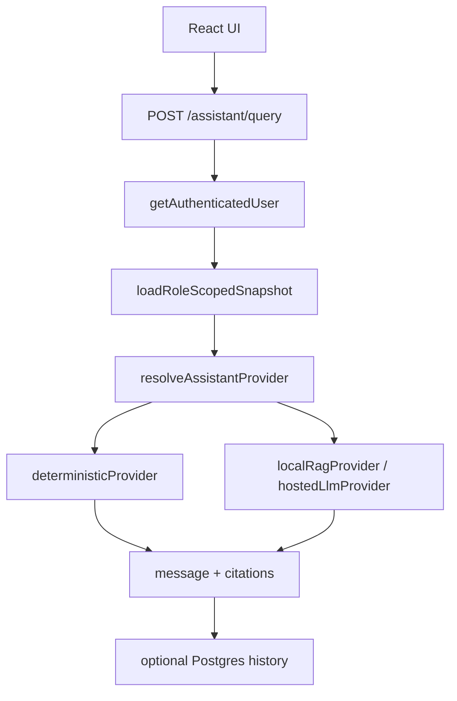

# Assistant LLM/RAG Follow-On Plan

This document defines how to add an **intelligent LLM/RAG assistant** behind the existing `POST /assistant/query` endpoint without bypassing backend auth or Canton visibility.

## Non-negotiables

| Rule | Why |
|------|-----|
| UI never calls LLM or Canton directly | Secrets, party resolution, and visibility stay server-side |
| `POST /assistant/query` remains the product contract | UI and future clients stay stable |
| Canton snapshot loaded **before** provider runs | Answers grounded in role-scoped ledger truth |
| Document retrieval filtered **before** embedding search | LLM must not see cross-user or cross-vault data |
| Chat does not execute ledger mutations | Use explicit UI actions (e.g. Initiate verification) |
| Provider failure falls back to deterministic | Demo and local dev stay usable without model keys |

## Architecture today



Code layout:

| File | Role |
|------|------|
| [`legacy-vault/api/src/routes/assistant.ts`](../../legacy-vault/api/src/routes/assistant.ts) | Auth + validation only |
| [`legacy-vault/api/src/assistant/service.ts`](../../legacy-vault/api/src/assistant/service.ts) | Snapshot load, provider dispatch, persistence |
| [`legacy-vault/api/src/assistant/providers/types.ts`](../../legacy-vault/api/src/assistant/providers/types.ts) | `AssistantProvider` interface |
| [`legacy-vault/api/src/assistant/providers/deterministicProvider.ts`](../../legacy-vault/api/src/assistant/providers/deterministicProvider.ts) | Current rule engine (default) |
| [`legacy-vault/api/src/assistant/providers/ragProvider.ts`](../../legacy-vault/api/src/assistant/providers/ragProvider.ts) | RAG scaffold (falls back until wired) |

## Provider selection

Configure via environment:

```text
ASSISTANT_PROVIDER=deterministic | local-rag | hosted-llm
ASSISTANT_MODEL_URL=           # e.g. http://localhost:11434 for Ollama
ASSISTANT_MODEL_API_KEY=       # hosted LLM only
ASSISTANT_RAG_TOP_K=5
```

Default: `deterministic` — no model dependency.

`local-rag` and `hosted-llm` currently fall back to deterministic until retrieval + model calls are implemented.

See [assistant policies](../../legacy-vault/api/src/assistant/policies/) for typed definitions:

| Module | Defines |
|--------|---------|
| `retrieval.ts` | Role-aware `filterAuthorizedDocuments`, `ROLE_DOCUMENT_ACCESS` |
| `safety.ts` | `validateUserMessage`, `validateAssistantResponse`, ledger field redaction |
| `providers.ts` | `PROVIDER_PROFILES`, `isProviderCorrectlyConfigured` |
| `context.ts` | `assembleAuthorizedContext` — Canton + docs package for LLM |

## Role-aware document retrieval

Documents are filtered **before** embedding search. Two gates apply:

1. **Vault visibility** — `ledger_vault_id` must be in the user's Canton snapshot, OR `owner_user_id` matches the session user.
2. **Role policy** — document type / `visible_to_roles` must permit the session role.

| Role | May retrieve | Typical document types |
|------|--------------|------------------------|
| `hnwi` | Own uploads + vault-linked docs | will, RWA schedules, full vault files |
| `heir` | Beneficiary-facing only | `beneficiary_summary`, `allocation_notice`, `payout_instruction` |
| `oracle` | Workflow/legal verification only | `oracle_verification_packet`, `release_trigger`, `death_certificate` |
| `admin` | Oversight/compliance metadata | `compliance_summary`, `audit_export`, `vault_overview` |

Heirs and oracles never receive full testator wills or other heirs' allocations via RAG.

Future migration adds `visible_to_roles text[]` and `document_type text` to `document_metadata`.

## Provider choices

| Provider | Env | Data leaves infra? | Use when |
|----------|-----|-------------------|----------|
| `deterministic` | `ASSISTANT_PROVIDER=deterministic` | No | Default — demos, production baseline |
| `local-rag` | `ASSISTANT_PROVIDER=local-rag` + `ASSISTANT_MODEL_URL` | No | Local Ollama experimentation |
| `hosted-llm` | `ASSISTANT_PROVIDER=hosted-llm` + `ASSISTANT_MODEL_API_KEY` | Yes | Production NLU after security review |

Unconfigured RAG/LLM providers fall back to deterministic — never fail open to an unauthenticated model.

## Safety checks

Enforced in code (`policies/safety.ts`) and at the service boundary:

| Check | Behavior |
|-------|----------|
| No ledger mutations from chat | Block phrases like "confirm release", "initiate verification" — direct users to UI |
| Role-scoped ledger prompt | `buildLedgerContextSummary()` redacts fields per role (oracle sees no asset token IDs) |
| Message length limit | 4,000 chars user input |
| Response length limit | 12,000 chars assistant output |
| Citation requirement | Responses over 500 chars require at least one citation |
| Provider fallback | Model errors → deterministic answer |
| No production prompt logging | `ASSISTANT_SAFETY_RULES.logPromptsInProduction = false` |

Chat never executes Daml choices. Initiate verification and confirm release remain explicit UI actions.

## Phase R1 — Authorized context assembly

**Goal:** Build the retrieval input set the LLM is allowed to see.

1. **Canton context** (already built)
   - `fetchLedgerSnapshotForSession(role, userId)` returns only vaults visible to the session party.
   - Select vault by `vaultId` from request or first visible vault.

2. **Document metadata filter** (Postgres `document_metadata`)
   - Filter by `owner_user_id = session user` OR vault linked to `ledger_vault_id` in user's visible snapshot.
   - Add columns in a future migration for `visible_to_roles text[]` and `ledger_vault_id` enforcement if needed.
   - Never pass storage URIs to the LLM without verifying the session user owns or observes the vault.

3. **Output shape for RAG**

```typescript
interface AuthorizedAssistantContext {
  user: SessionUser
  vault: VaultRecord | null
  ledgerCitations: AssistantCitation[]
  documentChunks: Array<{
    documentId: string
    fileName: string
    excerpt: string
    vaultId?: string
  }>
}
```

## Phase R2 — Embedding store + retrieval

**Goal:** Retrieve top-k chunks from authorized documents only.

| Option | Dev | Production |
|--------|-----|------------|
| pgvector in Postgres | Simple local setup | Managed Postgres + pgvector |
| External vector DB | Optional | Pinecone / Weaviate with per-org namespace |

Steps:

1. Ingestion pipeline (async, not in request path): upload → extract text → chunk → embed → store with `document_id`, `vault_id`, `owner_user_id`, `visible_to_roles`.
2. At query time: embed user message → search **within filtered document IDs only** → `ASSISTANT_RAG_TOP_K` chunks.
3. Attach chunk sources to `citations` in the response.

## Phase R3 — Model call + grounded prompt

**Goal:** Natural-language answers constrained to authorized context.

Prompt structure:

1. System: role, vault jurisdiction, safety rules (no legal advice disclaimer, no mutation instructions).
2. Context block: serialized Canton snapshot for selected vault (heirs, assets, release status).
3. Retrieved document excerpts with source labels.
4. User message.
5. Instruction: cite ledger fields and document filenames used; refuse if context insufficient.

**local-rag:** Ollama via `ASSISTANT_MODEL_URL` (e.g. `llama3.2`).

**hosted-llm:** OpenAI / Anthropic via `ASSISTANT_MODEL_API_KEY` — add redaction logging policy before production.

## Phase R4 — Hardening

- Unit tests: provider factory, authorized document filter, fallback on model timeout.
- Integration tests: Sarah vs Alex cannot retrieve each other's document chunks.
- Audit: log `assistant.query` events to `audit_events` with provider id, vault id, citation count (not full prompt text in production).
- Rate limits and token budgets per session.

## What is explicitly out of scope

- OpenClaw as a product dependency
- Browser-side LLM calls
- Ungated document corpus search
- Agentic auto-execution of release commands from chat

## Suggested implementation order

1. `retrieveAuthorizedContext()` in `ragProvider.ts` using existing snapshot + `document_metadata` queries.
2. Wire Ollama behind `local-rag` with deterministic fallback on error.
3. Add pgvector migration + ingestion job for vault PDFs/wills.
4. Add hosted provider + production secrets review.
5. Optional streaming via `POST /assistant/query/stream` (separate follow-on).

## Related docs

- [ASSISTANT.md](ASSISTANT.md) — current assistant behavior
- [PHASE8_HARDENING.md](PHASE8_HARDENING.md) — security and test posture
- [LINKUP_MCP.md](LINKUP_MCP.md) — optional Cursor-only RAG (not the product path)
