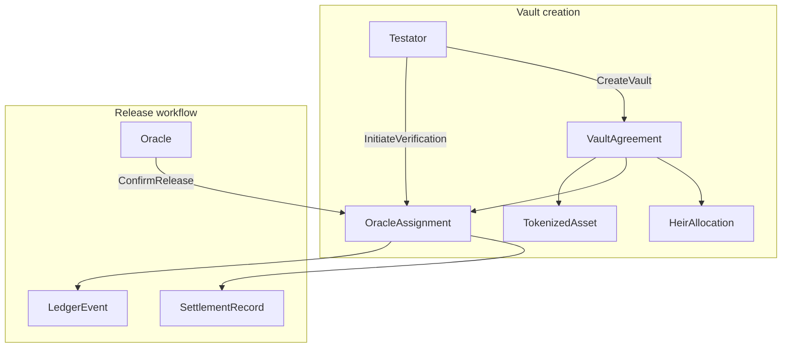

# Legacy Vault — Daml contract specification (Phase 1)

Single source of truth for **Step 2** smart contracts. Maps the React mock layer to Daml templates, choices, and Canton-style party visibility.

**Implement in:** [`legacy-vault/daml/`](../../legacy-vault/daml/)  
**UI references:** [`fixtures.ts`](../../legacy-vault/ui/src/lib/mock/fixtures.ts) · [`types.ts`](../../legacy-vault/ui/src/lib/mock/types.ts) · [`redactVault.ts`](../../legacy-vault/ui/src/lib/scope/redactVault.ts) · [`releaseWorkflow.ts`](../../legacy-vault/ui/src/lib/mock/releaseWorkflow.ts)  
**Related:** [DAML_SETUP.md](./DAML_SETUP.md) · [ROLE_VISIBILITY_MATRIX.md](./ROLE_VISIBILITY_MATRIX.md)

---

## Design goals

1. **Ledger-enforced privacy** — heirs and oracles see different contracts/fields, not just client-side redaction.
2. **Demo parity** — sandbox seed data matches **VLT-001** (*My Will*) and demo logins in [`auth.ts`](../../legacy-vault/ui/src/lib/auth.ts).
3. **Release workflow on-ledger** — oracle `ConfirmRelease` replaces `sessionStorage` overrides in [`ReleaseWorkflowContext`](../../legacy-vault/ui/src/context/ReleaseWorkflowContext.tsx).



---

## Parties

### Sandbox party IDs (allocate in `Setup.daml`)

| Party ID | UI login | Role | Notes |
|----------|----------|------|-------|
| `Testator_Sarah` | `sarah.m` | HNWI / testator | Signatory on vault creation |
| `Heir_Alex` | `alex.h` | Primary heir | Observer on own `HeirAllocation` + linked assets |
| `Heir_Maya` | `heir.maya` | Secondary heir | Same pattern; no UI login (fixture only) |
| `Heir_Sam` | `heir.sam` | Heir (William's vault) | VLT-004 |
| `Oracle_Sterling` | `oracle@lawfirm` | Law firm oracle | Signatory on `ConfirmRelease` |
| `Oracle_Other` | `oracle@otherfirm` | Alternate oracle | VLT-003 only |
| `Admin_Trust` | `admin@legacyvault` | Trust administrator | Observer on oversight templates |
| `Testator_William` | `james.a` | Separate client | VLT-004 testator (fixture uses `james.a`) |

### UI session → ledger party (integration)

| `SessionUser.id` | Query as party |
|------------------|----------------|
| `sarah.m` | `Testator_Sarah` |
| `alex.h` | `Heir_Alex` |
| `oracle@lawfirm` | `Oracle_Sterling` |
| `admin@legacyvault` | `Admin_Trust` |

Demo auth stays in the UI; JSON API queries use the mapped **ledger party** + sandbox JWT.

---

## Enumerations

Mirror [`types.ts`](../../legacy-vault/ui/src/lib/mock/types.ts):

```daml
-- AssetClass
data AssetClass = RWA | NFT | Security deriving (Eq, Show)

-- SettlementStatus (Track 2 — tokenized RWA lifecycle)
data SettlementStatus = Registered | PendingRelease | Settled deriving (Eq, Show)

-- ReleaseStatus (Track 3 — oracle workflow)
data ReleaseStatus = Idle | PendingVerification | ReleaseTriggered deriving (Eq, Show)

-- VaultStatus (UI StatusBadge)
data VaultStatus = Active | Verified | Archived | Pending deriving (Eq, Show)
```

---

## Templates

### 1. `VaultAgreement`

Full vault metadata — **testator signatory**, **admin observer**. Heirs and oracle do **not** observe this contract (privacy).

| Field | Type | UI source |
|-------|------|-----------|
| `vaultId` | `Text` | `VaultRecord.id` e.g. `VLT-001` |
| `name` | `Text` | `VaultRecord.name` |
| `jurisdiction` | `Text` | `VaultRecord.jurisdiction` |
| `totalValueNumeric` | `Decimal` | `VaultRecord.totalValueNumeric` |
| `lastAccessed` | `Text` | `VaultRecord.lastAccessed` |
| `status` | `VaultStatus` | `VaultRecord.status` |
| `testator` | `Party` | allocated testator party |
| `oracle` | `Party` | assigned oracle party |

**Signatories:** `testator`  
**Observers:** `Admin_Trust`

---

### 2. `TokenizedAsset`

Per-asset registry row (Track 2). Linked to vault; visible to testator, admin, and **intended heir only**.

| Field | Type | UI source |
|-------|------|-----------|
| `assetId` | `Text` | `VaultAsset.id` |
| `vaultId` | `Text` | parent vault |
| `name` | `Text` | `VaultAsset.name` |
| `tokenId` | `Text` | `VaultAsset.tokenId` |
| `assetClass` | `AssetClass` | `VaultAsset.assetClass` |
| `settlementStatus` | `SettlementStatus` | `VaultAsset.settlementStatus` |
| `intendedHeir` | `Party` | maps from `intendedHeirId` |
| `status` | `VaultStatus` | `VaultAsset.status` |

**Signatories:** `testator`  
**Observers:** `intendedHeir`, `Admin_Trust`

---

### 3. `HeirAllocation`

Heir-scoped view (Track 1 privacy). One contract per heir per vault.

| Field | Type | UI source |
|-------|------|-----------|
| `vaultId` | `Text` | `VaultRecord.id` |
| `vaultName` | `Text` | for heir dashboard labels |
| `heir` | `Party` | heir party |
| `allocationLabel` | `Text` | `VaultHeir.allocationLabel` |
| `assetIds` | `[Text]` | asset IDs where `intendedHeirId` matches |

**Signatories:** `testator`  
**Observers:** `heir`, `Admin_Trust`

**Ledger rule:** Heir_Alex queries return `HeirAllocation` + `TokenizedAsset` where `intendedHeir == Heir_Alex`. They must **not** fetch other heirs' allocations or full `VaultAgreement` asset lists.

---

### 4. `OracleAssignment`

Oracle trigger workflow (Track 3). **No asset or heir details.**

| Field | Type | UI source |
|-------|------|-----------|
| `vaultId` | `Text` | `VaultRecord.id` |
| `vaultName` | `Text` | banner / desk labels |
| `testator` | `Party` | for audit trail |
| `oracle` | `Party` | `VaultRecord.oracleId` → party |
| `releaseStatus` | `ReleaseStatus` | `VaultRecord.releaseStatus` |

**Signatories:** `testator`  
**Observers:** `oracle`, `Admin_Trust`

---

### 5. `SettlementRecord`

Created when oracle confirms release. Drives Settlements tab + beneficiary payout card.

| Field | Type | UI source |
|-------|------|-----------|
| `vaultId` | `Text` | |
| `vaultName` | `Text` | |
| `beneficiary` | `Party` | primary payout heir (demo: Alex) |
| `beneficiaryLabel` | `Text` | e.g. `Alex Henderson` |
| `payoutStatus` | `Text` | `pending` (matches ledger row) |
| `confirmedBy` | `Party` | oracle party |

**Signatories:** `oracle`  
**Observers:** `beneficiary`, `testator`, `Admin_Trust`

---

### 6. `LedgerEvent` (optional audit row)

Maps to [`LedgerEntry`](../../legacy-vault/ui/src/lib/mock/types.ts) / [`MOCK_LEDGER`](../../legacy-vault/ui/src/lib/mock/fixtures.ts).

| Field | Type | Notes |
|-------|------|-------|
| `eventId` | `Text` | e.g. `led-release-VLT-001` |
| `vaultId` | `Text` | |
| `vaultName` | `Text` | |
| `action` | `Text` | human-readable action string |
| `status` | `VaultStatus` | |
| `viewers` | `[Party]` | parties who observe this event |

**Signatories:** party that caused the event (oracle or testator)  
**Observers:** `viewers`

---

### 7. `SecurityEventRecord` (optional)

Maps to [`SecurityEvent`](../../legacy-vault/ui/src/lib/mock/types.ts).

| Field | Type | Notes |
|-------|------|-------|
| `eventId` | `Text` | |
| `vaultId` | `Text` | |
| `eventType` | `Text` | e.g. `Release Trigger Confirmed` |
| `targetAsset` | `Text` | vault name in demo |
| `integrityStatus` | `Text` | `verified` \| `flagged` \| `blocked` |

**Observers:** same pattern as `viewerIds` in fixtures.

---

## Choices

| Choice | Controller | On template | UI trigger | Effect |
|--------|------------|-------------|------------|--------|
| `CreateVault` | `testator` | — (script) | `/vaults/new` (later) | Creates `VaultAgreement`, `OracleAssignment`, `HeirAllocation` × N, `TokenizedAsset` × N |
| `AddHeir` | `testator` | `VaultAgreement` | wizard (later) | New `HeirAllocation` |
| `RegisterAsset` | `testator` | `VaultAgreement` | wizard token list | New `TokenizedAsset` |
| `InitiateVerification` | `testator` | `OracleAssignment` | Archival Assistant **Initiate verification** | `releaseStatus` → `PendingVerification` |
| `ConfirmRelease` | `oracle` | `OracleAssignment` | **Confirm release trigger** banner | `releaseStatus` → `ReleaseTriggered`; create `SettlementRecord` + `LedgerEvent` + `SecurityEventRecord` |
| `ArchiveVault` | `testator` | `VaultAgreement` | admin/testator (later) | `status` → `Archived` |

### Release state machine

```text
Idle  --InitiateVerification-->  PendingVerification  --ConfirmRelease-->  ReleaseTriggered
```

Matches [`ReleaseStatus`](../../legacy-vault/ui/src/lib/mock/types.ts) and [`getEffectiveReleaseStatus`](../../legacy-vault/ui/src/lib/mock/releaseWorkflow.ts).

---

## Visibility matrix (ledger)

| Role | Contracts visible | Must NOT see |
|------|-------------------|--------------|
| **HNWI (testator)** | `VaultAgreement`, all `TokenizedAsset`, all `HeirAllocation`, own `OracleAssignment` | Other testators' vaults |
| **Heir** | Own `HeirAllocation`, `TokenizedAsset` where `intendedHeir == self` | Other heirs' allocations, full vault asset list, other clients |
| **Oracle** | `OracleAssignment` for assigned vaults | `TokenizedAsset` details, `HeirAllocation` for other heirs |
| **Admin** | All of the above | — |

Implementation matches [`redactVault`](../../legacy-vault/ui/src/lib/scope/redactVault.ts) and [`vaultVisibleToRole`](../../legacy-vault/ui/src/lib/scope/redactVault.ts):

| UI `visibility` | Ledger source |
|-----------------|---------------|
| `full` | testator/admin queries |
| `allocation` | `HeirAllocation` + filtered assets |
| `trigger` | `OracleAssignment` only |

---

## Seed data — VLT-001 (primary demo)

From [`fixtures.ts`](../../legacy-vault/ui/src/lib/mock/fixtures.ts). **`Setup.daml`** must create:

**VaultAgreement**
- `vaultId`: `VLT-001`
- `name`: `My Will`
- `jurisdiction`: `Geneva, CH`
- `totalValueNumeric`: `1240000000.0`
- `status`: `Verified`
- `testator`: `Testator_Sarah`
- `oracle`: `Oracle_Sterling`

**OracleAssignment**
- `releaseStatus`: `PendingVerification` (matches fixture default)

**HeirAllocation**
| Heir | allocationLabel | assetIds |
|------|-----------------|----------|
| `Heir_Alex` | Primary heir — 60% | `AST-7112` |
| `Heir_Maya` | Secondary heir — 40% | `AST-3349` |

**TokenizedAsset**
| assetId | name | tokenId | class | settlement | intendedHeir |
|---------|------|---------|-------|------------|--------------|
| `AST-7112` | Family Home (NYC) | `NFT-7721` | NFT | Registered | `Heir_Alex` |
| `AST-3349` | Investment Portfolio | `TKN-9004` | RWA | PendingRelease | `Heir_Maya` |

**Optional:** seed VLT-002–004 for admin breadth (same pattern).

---

## Post-`ConfirmRelease` artifacts (VLT-001)

When oracle exercises `ConfirmRelease`, create rows matching [`buildReleaseLedgerEntries`](../../legacy-vault/ui/src/lib/mock/releaseWorkflow.ts) and [`buildReleaseSecurityEvents`](../../legacy-vault/ui/src/lib/mock/releaseWorkflow.ts):

**LedgerEvent**
1. `led-release-VLT-001` — action: `Release trigger confirmed — atomic settlement queued` — viewers: Sarah, Alex, Oracle, Admin
2. `led-payout-VLT-001` — action: `Beneficiary payout — Alex Henderson — pending` — viewers: Sarah, Alex, Admin

**SecurityEventRecord**
1. `sec-release-VLT-001` — `Release Trigger Confirmed` — viewers: Oracle, Sarah, Admin
2. `sec-settlement-VLT-001` — `Atomic Settlement Queued` — viewers: Sarah, Alex, Oracle, Admin

**SettlementRecord**
- `beneficiary`: `Heir_Alex`
- `payoutStatus`: `pending`

---

## Daml Script tests (Phase 4)

| Test | Assert |
|------|--------|
| `testHeirVisibility` | `Heir_Alex` sees 1 `HeirAllocation`, 1 `TokenizedAsset`; does not see Maya's asset contract |
| `testOracleIsolation` | `Oracle_Sterling` sees `OracleAssignment` for VLT-001; does not see `TokenizedAsset` |
| `testReleaseHappyPath` | `InitiateVerification` → `ConfirmRelease` → `SettlementRecord` exists; `releaseStatus == ReleaseTriggered` |
| `testAdminOversight` | `Admin_Trust` sees all VLT-001 templates |

---

## UI integration (Phase 6 preview)

| UI module | Ledger replacement |
|-----------|-------------------|
| [`useVaultScope.ts`](../../legacy-vault/ui/src/lib/scope/useVaultScope.ts) | Query contracts for acting party; assemble `VaultScopeResult` |
| [`ReleaseWorkflowContext.tsx`](../../legacy-vault/ui/src/context/ReleaseWorkflowContext.tsx) | `confirmRelease` → exercise `ConfirmRelease`; `setPendingVerification` → `InitiateVerification` |
| [`fixtures.ts`](../../legacy-vault/ui/src/lib/mock/fixtures.ts) | Fallback when `VITE_USE_MOCK_LEDGER=true` |

Env vars: `VITE_USE_MOCK_LEDGER`, `VITE_LEGACY_VAULT_API`, `VITE_DAML_LEDGER_ID` — see [`UI_LEDGER_INTEGRATION.md`](UI_LEDGER_INTEGRATION.md).

---

## Canton alignment

| Hackathon track | Contract feature |
|-----------------|------------------|
| **1 — Privacy** | Multi-template observers; heirs never sign on full vault |
| **2 — RWA** | `TokenizedAsset` with `tokenId`, `assetClass`, `settlementStatus` |
| **3 — Settlement** | Oracle-gated `ConfirmRelease` → `SettlementRecord` |

References: [Canton Network docs](https://docs.canton.network/) · [Privacy model](https://docs.canton.network/) · [Daml docs](https://docs.daml.com/)

Local **Daml Sandbox** is the first target; Canton DevNet deployment is a later step.

---

## Phase 2 checklist (next)

- [x] Add `legacy-vault/daml.yaml` + `daml/Vault.daml` implementing templates above
- [x] Add `daml/Scripts/Setup.daml` seeding VLT-001
- [x] `daml build` succeeds
- [ ] Script tests pass (Phase 4)
- [x] Cross-link this doc from [daml/README.md](../../legacy-vault/daml/README.md)

---

*Phase 1 — contract specification. Last updated when Daml SDK 2.2.0 environment is ready.*
